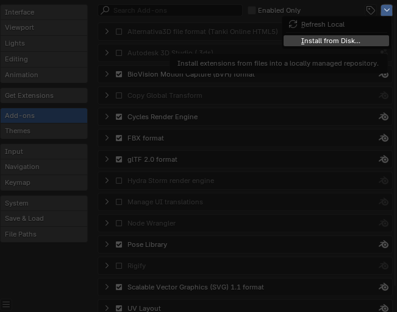

# Tanki XML Map Importer for Blender

A Blender addon that imports the old XML map files from Tanki online into Blender.
Its pretty slow currently, blender will freeze for a bit after you import your map.

## Features

- Import XML map files with proper positioning of all props
- Automatically load textures
- Configure coordinate system conversions (unnecessary)

## Requirements

- Blender 4.4 or newer (only tested in 4.4, idk if it works in other versions, but it def has to be above 4.0)
- 3DS importer addon enabled in Blender (comes with Blender)
- Prop libraries

## Installation

Firstly download the .py file by clicking on it and then the download button. 
 

In blender, go to Edit > Preferences and click the "add-ons" button. From there click the arrow on the top right and click "Install from disk". 
 

Select the .py file you downloaded and you should be good to go.

## Setting Up

1. Set the "Prop Libraries Directory" to the folder containing all your prop libraries
2. Each prop library should be in its own subfolder with a `library.xml` file (use [this one](https://github.com/MapMakersAndProgrammers/tanki-prop-libraries) if yours doesnt have that (the flash one) ) 

## Usage

1. Go to File > Import > XML Map (.xml)
2. Select your XML map file
3. Configure import options
4. Click "Import XML Map"

